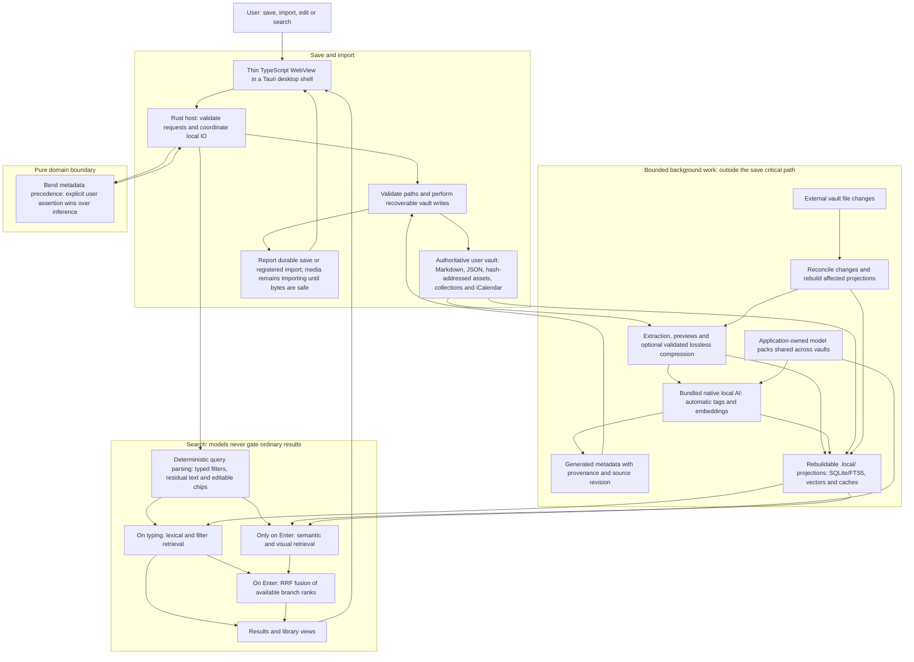

# Product boundaries

This is the short architecture summary. The [system wiki](wiki/README.md)
explains the full behavior; the [execution plan](implementation/README.md)
provides task dependencies and the [decision register](implementation/DECISIONS.md)
records approval gates.

Second Brain is a desktop-first, local-first, AI-powered self-organising library,
not a chatbot. Native core AI is required and bundled, not an optional add-on.
Only the metadata domain rule is implemented and checked today. The sections
below describe intended behavior, not available application features.

## Technical flow

This diagram shows the intended local runtime. Tauri/TypeScript/Rust are
recommended, while the Bend/native integration remains a decision gate. Only
the Bend metadata-precedence rule exists today; its proofs do not cover host IO.

- **Source of truth:** the vault owns user intent and generated metadata;
  `.local/` is disposable, device-local, and excluded from sync. Background work
  preserves user Markdown, custom tags, corrections and rejections.
- **Save boundary:** registration is not a completed backup. Exact original-file/
  source-byte preservation is the default. Extraction, optional lossless
  compression and AI run afterwards; enabled compression publishes a new immutable
  blob and recoverably updates references rather than overwriting an existing asset.
- **Search boundary:** hard filters constrain each retrieval branch before
  top-k selection, or require over-fetch/refill. Ordinary browsing and lexical
  search remain available while models load or are repaired.
- **Scope:** analysis is offline and local. URL bookmarks do not fetch pages;
  web capture, mobile clients and sync are deferred and omitted here.

## Ownership

The user-owned vault is authoritative: `Items/` holds user Markdown, `Assets/`
supported-format hash-addressed media, future `Captures/` HTML/resource manifests,
`Metadata/` versioned JSON and recoverable transactions, `Collections/` view
definitions, and `Reminders/` iCalendar. `.local/` contains device-local,
disposable projections excluded from sync. Model packs are application-owned
and shared across vaults. Required core weights/runtime ship with the normal
installer; extra models need demonstrated scope and quality justification.

Persist notes, tags, corrections, Spaces, Smart Space definitions, reminder links,
and provenance in open files. Preserve user Markdown during enrichment.
The system creates automatic tags in a generated layer without per-tag approval.
Custom user tags remain separate and authoritative: background processing never
overwrites or removes them. Explicit corrections/rejections persist; promotion
to a custom tag is a user action. Guesses retain source, score/calibrated
confidence, engine/version, generation time and source revision.

Deduplicate exact bytes by SHA-256; near duplicates are relationships, not
replacements. Shared assets survive deletion of one referencing item.
Validate paths and use recoverable writes before reporting durable success.
External file changes must reconcile into the index.

## Retrieval and resources

Saving, browsing, and lexical search work offline without accounts and remain
safe while AI loads or is repaired. Model-free operation is degraded recovery
or an incomplete development milestone, not a valid full release.
SQLite/FTS5 is a rebuildable projection with phrase/snippet support.
Deterministic parsing produces typed filters, residual text, and spans.
Unqualified relative dates mean saved time; ambiguity remains user-editable.
Parsing, chips and inexpensive lexical/filter results update live. Semantic and
visual retrieval run only on Enter, never typing/debounce/idle timers. RRF fuses
independent available branch ranks; hard filters constrain each branch before
top-k, or require over-fetch/refill. Models never gate ordinary search.

Start with flat embeddings; add ANN only after benchmarks justify it.
Bound/cancel background work and cache size. Defer extraction, optimization,
OCR, embeddings, and transcription from the save critical path. Import states
distinguish registered work from bytes safely persisted.

## Technology and unresolved decisions

The source recommends Tauri 2, a thin TypeScript WebView, and Rust host integration.
The owner additionally requests Bend. Start pure domain logic in Bend and prove
it directly; decide the tested Bend/native boundary before building a shell.
Do not claim Bend proofs verify Rust or host IO. No shell/model dependencies
are included merely for future use.

Exact original-file/source-byte preservation is the default. Lossless compression
is an optional setting, disabled by default, for subsequent imports only.
No canonical lossy compression is approved. Enabled profiles must preserve all
metadata, decoded content and familiar formats, with integrity and AI-quality
validation. Unsupported, unverifiable, non-saving or signed inputs retain exact
input bytes. Preference changes and upgrades never retroactively recompress the
vault. Hash-addressed blobs are immutable;
publish a new blob and recoverably update references before garbage collection.
Web capture, imported snapshots and their viewer are deferred. Current URL
bookmarks store URL/user-provided title/notes without page acquisition.
The future capture viewer must be inert, network-denied and unprivileged.
Deletion recovery/retention, launch scope, runtime integration and distribution
remain explicit decision gates.

Deliver development slices in dependency order, but require bundled native AI,
automatic organisation and qualified original-byte/optional-lossless storage
before release.
Specialised media/generation, web capture, mobile and sync have later scoped work.
Measure organisation precision/recall/coverage, latency, RAM and disk use.
The source's SLOs are targets, not verified promises.
