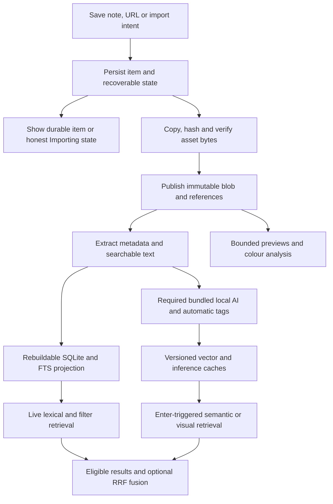
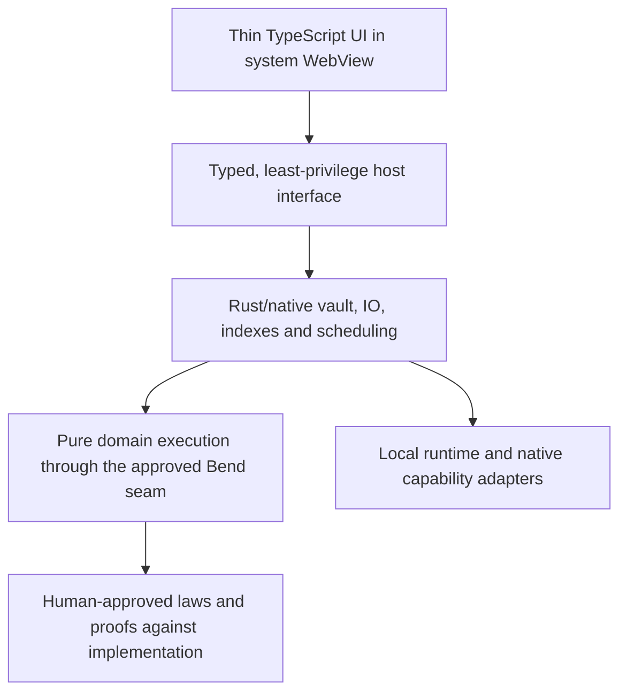

# How Second Brain works

Second Brain is an **AI-powered, self-organising personal library** for links,
notes, images, documents, audio and video. Native local AI is an innate part of
the shipped product, not an optional add-on or a cloud service. You save
something once; the system organises it automatically and helps you find it.
It is a library and search engine, not a chatbot.

**Implementation status:** only the small Bend metadata-precedence module and
its two draft laws exist today. Everything described below is intended behavior,
not a claim that an installable application exists.

This wiki is the public product and technical contract. The
[decision register](../implementation/DECISIONS.md) distinguishes confirmed
requirements from recommendations needing approval. The
[execution plan](../implementation/README.md) maps the work to ordered GitHub
issues. Agents need no access to a separate planning service.

**Confirmed scope:** the normal installer includes the smallest, fastest
meaningful local model/runtime that meets measured organisation precision and
quality. Prefer one compact model; additional core models need demonstrated
necessity and approval. Lossy compression is enabled by default while preserving
all metadata, with a setting to disable it. Web-page capture is deferred; ordinary
URL bookmarks store the URL and user-provided title/notes without fetching pages.

## 1. The system in plain English

### Save now; enrich afterwards

Saving a note or URL creates a durable item immediately. Importing a large file
also creates an item immediately, but it honestly says **Importing** until the
bytes are safely copied. A registered import is not a completed backup.

The application subsequently extracts information, makes previews, indexes
text, and runs its bundled local AI in bounded background work. None of those
steps is a condition for saving your notes or seeing the item in the library.
Failures are visible and retryable; they do not discard your annotations.
Automatic organisation runs after ingestion without waiting for Enter. A missing,
corrupt or temporarily unloaded core model leaves safe browsing/editing available
in a visibly degraded state; it is not a complete product tier.

### Your folder is the library

The authoritative data is a normal folder, called a **vault**. Notes are Markdown,
metadata is versioned JSON, reminders use iCalendar, and stored media remains in
supported familiar formats with all metadata preserved. Default lossy compression
may change media content/bytes; disabling it preserves newly imported source bytes.
HTML snapshots and captured resources are a future capability, not current work.

The application keeps a disposable search database and previews around those
files. Clearing an index means rebuilding search, not losing your notes,
custom tags, collection definitions or reminders. Models are shared application
installations rather than duplicated inside every vault.

### Search has two speeds

As you type, the application recognises dates, sources and other filters,
shows editable chips, and updates inexpensive text/filter results. **Press Enter
to run semantic or visual retrieval.** Typing, debounce and idle timers do not
trigger model-based retrieval.

For example:

> teal screenshots from LinkedIn I saved last week about Webflow CMS

can become colour, kind, source and saved-time filters plus the text
“Webflow CMS”. You can inspect and change the interpretation. Ordinary search
remains available while the core model loads or is being repaired. Enter adds
conceptually similar results through the bundled local model, even
when those items do not contain exactly the same words.

### Automatic tags and custom tags coexist

The system **creates automatic tags** from extracted information and its native
local AI. It does not ask you to approve every generated tag. Release qualification
requires useful measured precision, recall and coverage, not just a small model
or abstention on every difficult item.

Your custom tags remain a separate, authoritative layer. A background job or
model upgrade cannot rename, remove or overwrite them. Generated labels show
their origin and evidence. You can reject one or promote it to a custom tag.
Explicit corrections and rejections survive reindexing.

If a model labels something “wood” and you correct it to “laminate”, the effective
view respects your correction. If a custom label and an automatic label share
the same name, preserve their separate records and show the custom assertion
as authoritative instead of destroying either record.

### Organise without moving files

A **Space** is a manually populated named collection. An item can belong to
several Spaces; adding it to one does not copy or move its assets.

A **Smart Space** is a saved query. It updates as the library changes and as
relative dates such as “this week” advance. Its initial membership is based on
supported exact filters and lexical predicates, not a limited nearest-neighbour
result list. Stored automatic tags can be queried as recorded evidence.
Semantic-only membership needs a separate threshold and model-change policy.

An **Explore** view uses the same search machinery to show related sources,
authors, dates, colours, concepts and near duplicates.

### Local does not mean magical privacy

Analysis stays on the device. Core AI ships with the application and works
offline without an account, inference service or first-use model download.
Current URL bookmarks do not fetch page content. Future capture, optional
extra capabilities and approved updates may make explicit network requests;
future saved snapshots must not silently reload remote resources.

The open folder is not encrypted merely because it is local. Other local users,
backups and any folder-sync provider you select may read its files. Encryption
and optional sync require their own approved security design.

## 2. Terms and canonical ownership

| Term | Meaning | Authoritative representation |
| --- | --- | --- |
| Vault | One user-owned library with a stable identity | Versioned vault contract and open files |
| Item | A logical saved reference, note or media record | Stable item ID, Markdown and companion JSON |
| Asset | Actual media/document/resource bytes, shareable between items | Immutable SHA-256-addressed file |
| Capture (deferred) | A future saved HTML representation and its resource associations | Future HTML and resource manifest |
| Custom tag | A user-authored label | `user.tags` in item JSON |
| Automatic tag | A generated label, not a user assertion | `inference.tags` with provenance |
| Correction or rejection | Explicit user intent affecting generated evidence | User-owned override/rejection records |
| Space | Named, explicit item membership | Collection definition plus item `space_ids` |
| Smart Space | Named saved-query view | Query text, typed AST, grammar version and sort |
| Reminder | Portable schedule, alarm and completion state | iCalendar UID, `VTODO`/`VALARM`, item linkage |
| Projection | An index/cache derived from canonical data | Device-local SQLite, vectors and derivatives |

An item ID survives a title or filename change. Separate items can reference the
same asset while retaining different URLs, notes, tags and reminders. Similar
URLs or similar-looking files do not justify silently merging logical items.

### Intended vault layout

```text
My Library/
├── Items/
│   └── <item-id>--readable-title.md
├── Assets/
│   └── <hash-prefix>/<sha256>--stable-suffix.ext
├── Captures/               # deferred; not created by the current build
│   └── <item-id>/
│       ├── snapshot.html
│       └── resources.json
├── Metadata/
│   ├── <item-id>.json
│   └── .transactions/       # recoverable in-flight file operations
├── Collections/
│   └── <collection-id>.json
├── Reminders/
│   └── <reminder-id>.ics
└── .local/                 # device-local, disposable, excluded from sync
    ├── index.sqlite
    ├── previews/
    ├── extracted/
    └── vectors/

Application storage outside vaults:
└── required bundled core model/runtime, manifests and optional extras
```

The schema task defines the exact current vault manifest, stable IDs, relative-path
rules, required fields and migration policy. This tree is a contract direction,
not an already implemented format. Capture schemas/viewers are deferred with
their feature rather than scaffolded now. If a user's sync setup cannot exclude
`.local/`, use equivalent device application storage keyed to vault identity.
SQLite/WAL files must not become a multi-device transport.

### Markdown and JSON have different jobs

Markdown owns user text. Minimum front matter identifies the item and companion
metadata file; avoid conflicting authoritative copies of URLs, asset paths and
timestamps in both formats. Recapture and model enrichment preserve the body.

Item JSON owns:

- source/request/final URLs, domain/platform, author, capture method and time;
- asset roles, paths, hashes, source filenames and original/stored-byte provenance;
- saved time and other separately identified timestamps;
- custom tags, Space memberships, custom fields, favourites, pinned/read/archive
  state, last-viewed state and explicit relationships;
- user overrides, rejected generated labels and explicit promotions;
- extracted/generated evidence, processing state and reminder links.

Generated facts carry source/method, engine or model version, generation time
and source revision. Where applicable they carry a score and calibrated
confidence. A cosine score is not automatically a probability. Colour coverage
is a measured proportion, not model confidence.

Published JSON schemas and versioned migrations must preserve unknown fields.
An index rebuild never migrates away a user's assertion. The example fields
above are not a substitute for the schema task's validated fixtures.

## 3. End-to-end data flow



### Durable ingestion and recovery

The critical save path assigns an ID, persists user/source information and
registers recoverable work. A failed disposable queue can be reconstructed
from canonical pending state.

Asset copying hashes while streaming to staged storage. Only verified complete
bytes are published at a content hash. Progress, cancellation, partial capture
and failure states are distinct. Temporary originals and the only copy of a
pending transaction do not belong exclusively in a deletable cache.

Background jobs bind to the item and source revision. Before committing a
result, they check that the item still exists and that the revision is current.
An old job cannot resurrect a deleted item or overwrite newer edits.

Use one coordinated local writer initially. File updates spanning several
records require recoverable manifests; atomic replacement of one file alone
does not make a multi-file operation crash-safe.

### Extraction before models

Prefer information already present in the source: MIME, dimensions, duration,
page count, source domain, timestamps, EXIF/XMP/GPS, camera/lens, codecs,
document text, HTML title and structured metadata. Cheap palette analysis
supplies colour evidence.

Core organisation and semantic/visual inference use the minimal sufficient
bundled model contract for the accepted content types. Specialised OCR, speech
or generative capabilities may remain later extras if not required by launch scope.
qpdf can transform PDF structure, but it is not a renderer or text/OCR engine.
The extraction adapter must handle unsupported, malformed, encrypted and scanned
documents explicitly.

### External edits

A live watcher plus startup reconciliation detects changes missed while closed.
An item rename preserves its ID. Missing individual files, duplicate IDs, invalid
JSON and hash mismatches are repair states, not excuses to delete surviving user
data. Incomplete scans suspend orphan garbage collection.

A file changed externally under a hash-addressed path no longer matches that
hash. Repair or reimport it; do not index new bytes under the old identity.

## 4. Storage, deletion and portability

### Exact deduplication

Hash actual stored bytes. Identical blobs can be shared, regardless of source
filename; one hash identifies one physical blob. Keep source filenames on each
logical reference. Perceptual similarity produces a relationship, not physical
deduplication.

### Default lossy compression and metadata preservation

**Lossy compression is enabled by default.** It may change encoded bytes and
decoded media content; it must preserve **all metadata**, including embedded
EXIF/XMP/GPS, capture times, author/copyright, orientation, ICC profiles and
unknown/private metadata blocks, alongside canonical provenance.

A setting disables lossy compression for subsequent imports, preserving their
source bytes. Changing that preference does not silently recompress the existing
vault, and disabling it cannot reconstruct information already discarded by
earlier lossy compression. UI and provenance must make this distinction explicit.
Do not retain a hidden full original by default and claim compression saved space.

Exact eligible formats, encoders and quality levels need measurement/approval.
Preserve supported formats and geometry; do not silently convert containers,
invalidate signed documents or discard unknown metadata. If the candidate's
metadata fidelity, integrity or organisation quality cannot be validated, retain
the input and report the skipped/failed optimisation.

Publish an optimised candidate at a **new** content hash, durably update only
policy-eligible references, and retain the old blob while referenced. Items
imported with lossy compression disabled keep their original reference. If safe reference accounting or validation
cannot be established, keep the source.

Previews and extracted caches can be compressed aggressively because they are
rebuildable. Distinguish canonical bytes, reclaimable caches and installed model
packs in the storage inspector.

### Deletion

Deleting an item removes its active record and its references through a
recoverable operation. A shared asset is collectible only when no item, capture
manifest, retained version/trash record, user link or transaction references it.
Deleting a Space deletes a view, not its items.

The recommended first policy is explicit app Trash with restore and confirmed
manual purge, without automatic expiry. That remains an owner decision.
The UI must describe actual recovery guarantees, not promise undo that does not
exist. Background work is invalidated before cleanup.

### Export and backup

Open files are necessary but not sufficient for safe backup. A consistent
snapshot must coordinate writes and preserve notes, metadata, collection
definitions, resources and reminder UIDs. Exclude disposable indexes, locks and
machine-specific model installations.

Move/restore a vault on another device and rebuild its projections without
network or models. Missing blobs and schema incompatibilities are explained
instead of silently ignored. Plain-folder backup is not encryption.

## 5. Search as a compiler and retrieval system

### Parse once into a typed plan

Natural language and explicit syntax compile into the same typed AST.
Recognised spans remain editable. Removing a chip can demote its text with a
suppression decision so it is not immediately re-created.

Examples include:

```text
type:image
format:pdf
source:linkedin
site:apple.com
saved:today
after:2026-09-01
before:2026-10-01
colour:teal
material:wood
texture:woven
captured-with:iphone
shows:macbook
author:"John Smith"
tag:"ClientA"
auto-tag:"architecture"
space:"Inspiration"
has:note
has:reminder
duration:>10m
size:<20MB
pages:>50
```

`tag:` is exact custom membership; `auto-tag:` matches separately recorded
generated labels. `type:pdf` may remain a documented compatibility alias for
`format:pdf`. Define quoting, escaping and precedence: `NOT`, then `AND`, then
`OR`, with parentheses.

Unqualified relative dates mean saved time. “Taken”, “published” and “due”
select other date fields. Relative queries retain their expression for later
evaluation; missing source dates do not silently fall back to saved time.
Timezone and week-start conventions require approval and must be visible.

Span offsets are zero-based, end-exclusive frontend UTF-16 code units; the Rust
parser must convert explicitly and test non-ASCII text.

### Target facet families

The ontology is broader than the launch capability list:

| Family | Examples and evidence |
| --- | --- |
| Dates | Saved, captured, published, modified, last viewed, due/completed |
| Type and format | Image/video/audio/note/link/webpage/document; MIME and kind |
| Provenance | Platform, domain, author/account, capture method, filename, import batch |
| Text | Exact phrase, notes, keywords, named entities, language, transcript |
| Visual | Colour/coverage, material, texture, pattern, object, scene, style, medium |
| Geometry | Dimensions, aspect ratio, orientation, composition |
| Place/device | GPS versus mentioned versus inferred place; capture device versus shown device |
| Media/document | Size, duration, codecs, resolution, frame rate, captions, pages, structure |
| User state | Custom tags/fields, Space, notes, favourite, pinned, read, archive, reminder |
| Generated state | Automatic tags, confidence/score origin, processing coverage/failure |
| Relationships | Exact/near duplicate, same source, related item, explicit user relationship |

Evidence-dependent filters expose incomplete coverage. Unknown, pending and
failed analysis are not “false”; both positive and negated inferred predicates
exclude unknown evidence by default. Explicit processing/unknown queries can
inspect it. An inferred location does not substitute for GPS.

### Lexical retrieval

SQLite/FTS5 is a local, rebuildable projection. Full-detail indexing supports
phrases and snippets. External-content FTS still requires consistent SQL backing
content; it cannot directly read arbitrary Markdown files.

Keep the database/WAL on one host. WAL permits reader/writer overlap, not
multiple simultaneous writers or safe cross-host network-file operation.
Coordinate checkpoints and use a release with current correctness fixes.

Apply typed predicates and paginate deterministically. A compound asset
constraint such as “red screenshots” matches one qualifying asset, not a red
photo plus an unrelated screenshot within the same item.

### Independent semantic branches and RRF

Text-semantic retrieval searches all eligible represented items, not just FTS
hits. Visual retrieval uses a compatible vision text/image space. An example
image uses that same visual space, not an unrelated sentence model.

Collapse chunk/frame/asset hits to one item rank in each branch:

```text
RRF(item) = sum_b 1 / (C + rank_b(item))
```

Ranks start at 1. Missing branches contribute zero. `C = 60` is an initial
evaluation value, distinct from result depth. Hard filters apply within candidate
retrieval; where an index cannot prefilter, over-fetch/refill instead of filtering
only a small top-k and losing matching results.

Exact required lexical clauses remain mandatory. Filter-only queries do not
compute a meaningless embedding. Optional bounded recency, exact-label and
relevant category refinements cannot admit ineligible items.

Cold models display progress while lexical results remain usable. A result
belongs to its query revision; edits cancel or ignore older semantic work.
Model-free operation is visible degraded recovery or an incomplete development
milestone, not a completed product tier; missing core AI needs repair.

## 6. Small local intelligence

### Packs and embedding compatibility

The normal installation includes its approved core model and native runtime;
users do not download an extra pack to enable the premise of the product.
Prefer one compact sufficient model, and justify any additional core model
against held-out quality and actual footprint/latency measurements. Shared manifests
identify weights, tokenizer, prompts, preprocessing, dimensions, normalisation,
modality and runtime version. Lazy load and unload with resource budgets.
Lazy loading is scheduling, not optional AI. Supported devices need a tested
native/CPU fallback; OS intelligence availability cannot be the sole core path.
Missing core weights/runtime is a visible repairable fault.

Models from different spaces or versions are not comparable. Native providers
may vary, but they must execute a compatible model contract or build separate
indexes. Rebuild incompatible vectors and prototypes without erasing user state.

MiniLM is a lightweight text benchmark candidate, not an approved final model
or proof that the complete organisation quality requirement is satisfied.
Its default 256-word-piece limit makes one embedding of an arbitrary PDF
incorrect. Use bounded token-aware sections, retain offsets and coverage, cap
vectors, and keep all successfully extracted text in FTS. Quantisation and ANN
require measured quality/performance benefits.

Vision uses matching image/text encoders, potentially within the same compact
model selected for core organisation rather than automatically adding weights.
Known ontology text vectors can be
cached per version; free-text visual queries still need the text encoder.
Include both encoders in package/RAM budgets.

Qualify the core on independent representative items, including the actual
default-compressed stored content. Measure precision, recall, useful coverage,
abstention/error handling, language support, cold/warm latency, RAM and installed
size. A tiny model that organises poorly, or tags nothing to appear precise,
does not pass the release gate.

### Personal category prototypes

Average compatible, normalised vectors from custom tags or explicitly confirmed
examples. Keep text and vision prototypes separate. Automatic outputs do not
train their own prototype and create a self-reinforcing loop.

Zero examples cannot define a category; a few examples are weak evidence.
Use evaluated automatic-assignment thresholds, and show uncertain candidates
as suggestions. A project/client label may not be semantically learnable.
Multiple centroids or a classifier come only after the simple baseline fails
evaluation.

Generated tagging runs during enrichment; it is separate from the
Enter-triggered **retrieval** rule. Accepted custom tags and explicit rejections
persist with models removed. Retained automatic labels keep their provenance
and expose stale/unavailable analysis appropriately.

### Media and optional generation

Video analysis samples a bounded set of representative frames; speech uses an
optional offline transcription pack. Retain timestamps and partial coverage;
never create unbounded frame vectors or transcode canonical media to make it
smaller. User-corrected transcripts become authored data.

Optional on-device generation may suggest summaries/titles or extract entities.
It does not rewrite notes or required query semantics. On Apple devices,
Foundation Models availability is OS/device/enablement/language gated.
Core AI is a later version-gated runtime candidate, not proof that needed weights
come preinstalled. Private Cloud Compute is outside the no-cloud baseline.

## 7. Deferred future web capture

Web capture is **not being implemented now**. T20/T21 remain future backlog
items and are not prerequisites for the current release. URL bookmarks remain
ordinary records containing the URL and user-provided title/notes; they neither
download/archive the page nor pretend that its unavailable content was analysed.
The following contract applies only when capture is explicitly scheduled later.

The baseline accepts URL bookmarks and imported HTML snapshots without requiring
a browser extension. A richer browser-capture adapter is separately approved;
Tauri's UI WebView is not an implicit general-purpose headless browser.

Capture records request/final URLs, title, domain, timestamp, method,
ready/partial/failed state and missing resources. Locally rewritten HTML is a
captured representation, not automatically a byte-exact HTTP response.
Readable extraction is derived; notes remain authored.

The guarantee is best-effort offline reading/visual use of what was captured.
Server APIs, authenticated services, expiring streams and interactive scripts
may not function. Retain useful source bookmarks even if capture fails.

Treat scripts, SVG, frames, CSS URLs, fonts and imported resources as untrusted.
The viewer has no privileged host commands, runs inertly and blocks remote loads.
Path validation, limits and decoder isolation protect the vault and application.
Authenticated capture, large media and recapture retention need explicit policies.

## 8. Implementation seams and verification



Bend owns suitable pure domain rules and transformations. Rust/native code owns
filesystem, OS, SQLite, network and runtime integration. **The actual callable
Bend/native seam is not yet proven feasible.** A bounded executable spike must
establish supported integration, serialization, errors and overhead before the
shell depends on it.

The existing `Metadata.resolve` implementation returns an explicit user value,
including an empty string, or inference when absent. Its laws are drafts awaiting
approval. A scalar precedence proof does not prove set-valued tags, durable
writes, search recall, safe HTML or model accuracy.

Use universal laws against actual pure implementations where applicable,
cross-language conformance for host integration, and real workflow/fault tests
for IO. Keep the approved laws intact rather than weakening them to pass code.

### Resource targets, not measured promises

| Operation | Starting target |
| --- | --- |
| Query parse | P95 < 2 ms |
| Structured filter update | P95 < 16 ms |
| Warm lexical first results at 100k items | P95 < 50 ms |
| Input/chip feedback | One rendered frame, not completed retrieval |
| Submitted warm semantic augmentation | < 150 ms |
| Idle model work with empty queue | Zero |
| Model loading/compression | Outside startup/save critical path |

Measure cold/warm 10k, 100k and 1m synthetic libraries, RAM, per-item disk,
model load, indexing contention, relevance, battery and partial coverage.
No chosen hardware, numerical cache budget or proven SLO exists yet.

## 9. Capability-ordered delivery

1. Approve startup policy and validate the domain/host execution seam.
2. Build schema, recoverable storage, imports, reconciliation and deletion.
3. Add deterministic extraction, FTS, typed queries and authored state.
4. Deliver desktop browsing, Spaces, reminders and previews as development slices.
5. Integrate the required bundled core model, automatic organisation, compatible
   semantic/visual representations and Enter/RRF.
6. Implement default lossy compression with metadata fidelity and its disable setting.
7. Qualify the AI-powered product, compressed-content organisation, portability
   and packaging; a model-free milestone is not a completed release.
8. Expand specialised media/OCR/generation, Explore, future web capture, mobile
   and optional sync according to their approved scopes and gates.

See the [task index](../implementation/README.md) for dependencies and parallel
lanes. A future feature has an issue, not a reason to scaffold its framework now.
Each selected release states its actual capability matrix.

## 10. Primary technical references

- [Tauri architecture](https://v2.tauri.app/concept/architecture/)
- [SQLite FTS5](https://www.sqlite.org/fts5.html) and
  [WAL constraints](https://www.sqlite.org/wal.html)
- [RRF algorithm explanation](https://learn.microsoft.com/en-us/azure/search/hybrid-search-ranking)
- [MiniLM model card and token limit](https://huggingface.co/sentence-transformers/all-MiniLM-L6-v2)
- [MobileCLIP models and separate model terms](https://github.com/apple/ml-mobileclip)
- [ONNX execution providers](https://onnxruntime.ai/docs/execution-providers/)
- [LiteRT](https://ai.google.dev/edge/litert)
- [Oxipng preservation options](https://github.com/oxipng/oxipng)
- [JPEG encoding versus lossless transcoding](https://raw.githubusercontent.com/mozilla/mozjpeg/master/usage.txt)
- [qpdf scope](https://qpdf.readthedocs.io/en/stable/overview.html)
- [FFmpeg distribution requirements](https://ffmpeg.org/legal.html)
- [iCalendar standard](https://www.rfc-editor.org/rfc/rfc5545)
- [Offline snapshot limitations](https://github.com/gildas-lormeau/SingleFile/blob/master/faq.md)
- [Apple Foundation Models availability](https://developer.apple.com/documentation/foundationmodels/generating-content-and-performing-tasks-with-foundation-models)

Sources explain technical constraints; they do not establish this application's
performance, model quality, legal clearance or delivery guarantees.
